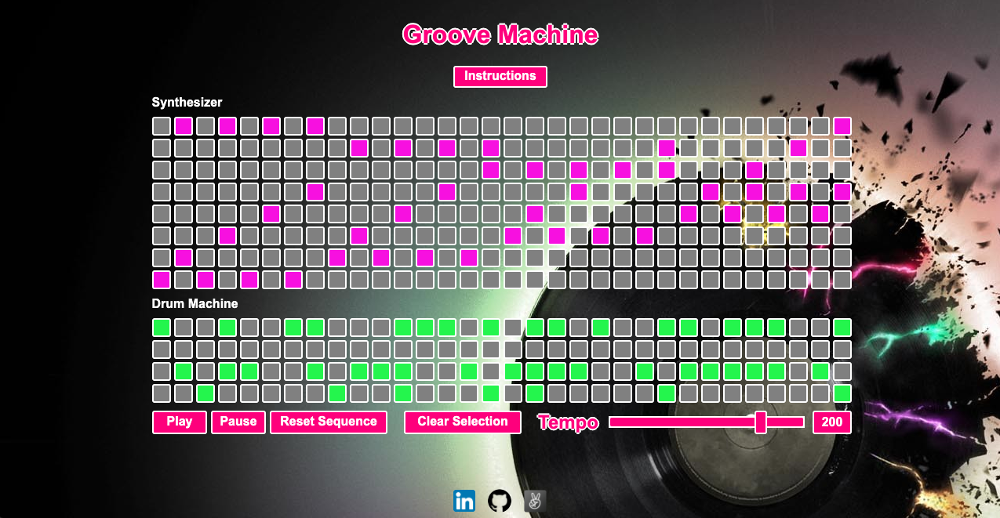

# Welcome to Groove Machine

Groove Machine is a 32 step sequencer with an 8 track, aeolian mode, tone selection grid and a 4 track Drum Machine with which users can create and manipulate original and groovy loops.

[Check it out here!](https://siascone.github.io/grooveMachine/)

## Technologies Used

Groove Machine was constructed utilizing a combination of JavaScript, Tone.js, HTML and CSS. JavaScript was used for the main logic along with Tone.js to generate the various synthesized sounds. HTML was used to structure the application and CSS was used for styling.

## Features

### Tone and Rhythm Selection

Users can easily select a unique arrangement of sounds from 8 tones and 4 rhythms mapped across a 384 checkbox input grid. Each row corresponds with a single tone that is generated using a Tone.js synth. Utilizing Tone.js' synth methods allows the application to generate the sound instantly upon each press of the button or step in the sequence during playback. This allows the appliction to be free of any stored tone library. The follwing code snippet demonstrates how a tone is generated in the program.

#### Tone 1

    new Tone.Synth({
         oscillator: {
             type: 'sine'
         },
         envelope: {
             attack: 0.01,
             decay: 0.2,
             sustain: 0.4,
             release: 0.5
         }
     }).connect(gain);
    
#### Rhythm 3

    new Tone.MetalSynth({
         frequency: 161.82,
         envelope: {
             attack: 0.001,
             decay: 0.5,
             release: 0.1
         },
         harmonicity: 5.1,
         modulationIndex: 32,
         resonance: 40,
         octaves: 1.5
     }).connect(gain);

The .connect(gain) function does two things. It first reduces the initial output volume of each synth to prevent clipping as well as any aural discomfort a user may have if experiencing the application via headphones. The function then sends the synth the master audio output so it can be heard.

### Step Sequence

The step sequence was achieved by the use of strategic DOM queries and a mapping of each row's nth input with arrays of tone synths and notes. The following code snippet demonstrates this logic.

     const notes = ['E5', 'D5', 'C5', 'B4', 'A4', 'G4', 'F#4', 'E4', 'B7', 'B7', 'E1', 'E1'];
     const rows = document.body.querySelectorAll('.row');
     const spans = document.body.querySelectorAll('span');
     
     function repeat(time) {
     let step = index % 32;
     for (let i = 0; i < rows.length; i++) {
         let synth = synths[i],
             note = notes[i],
             row = rows[i],
             input = row.querySelector(`label:nth-child(${step + 1})`);
             span = input.querySelector(`span`);
             checkbox = input.querySelector('input');
             if (checkbox.checked) {
                 if (i <= 8 || i === 11) {
                     synth.triggerAttackRelease(note, '8n', time);
                 } else {
                     synth.triggerAttackRelease('8n', time);
                 }
             }
             span.classList.toggle('highlight')
         }
         index++;
     }

### Playback and Reset

Users can manipulate playback in a number of ways. The Play/Pause buttons start and stop the sequencer by calling Tone.Transport.start() or .stop() respectively. The Reset button returns the sequence to the original starting position and pauses playback by setting the step interval to zero and calling the .stop() function. The tempo slide allows the user to change the beats per minute(bpm) by adjusting the Tone.Transport.bpm.value. And lastly the Clear Selection button clears all selected tones and rhythms by setting any checked input to .checked === false.

## Planned Future Features

* Scale key and drum selection.
* Loop recording, playback and sharing.

